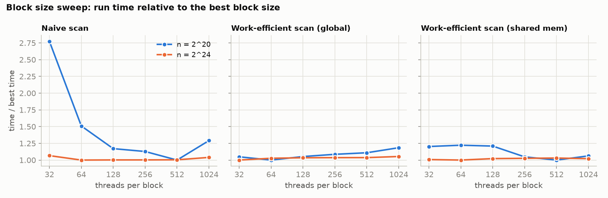
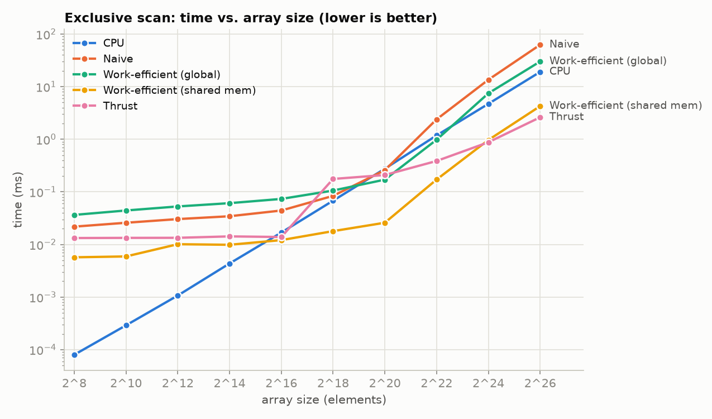
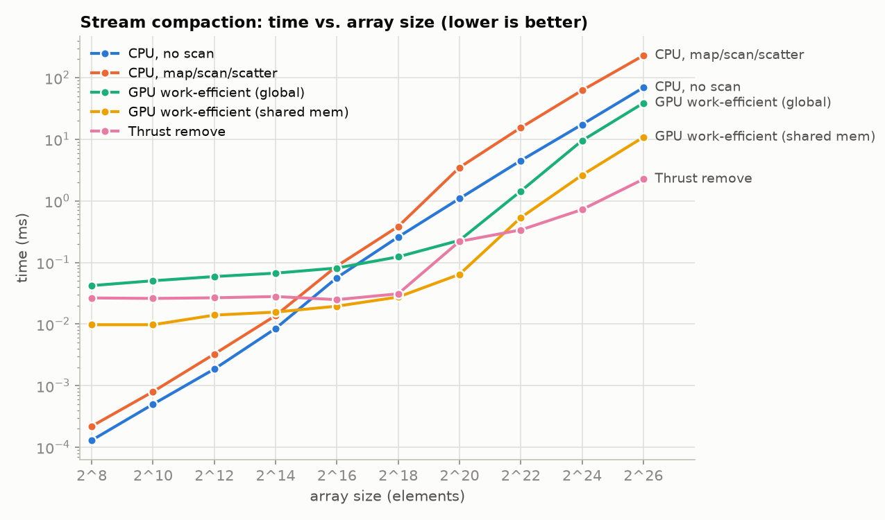
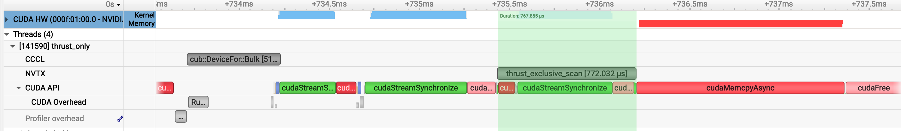

CUDA Stream Compaction
======================

**University of Pennsylvania, CIS 565: GPU Programming and Architecture, Project 2**

* Hangyu Zhang
  * [LinkedIn](TODO), [personal website](TODO)
* Tested on: Ubuntu 24.04, NVIDIA GB10 (DGX Spark), 20-core Arm, 121 GB unified LPDDR5X, CUDA 13.0

## Features

Scan (exclusive prefix sum) and stream compaction (remove the `0`s from an `int` array), in the `stream_compaction` subproject:

* **CPU**: `scan`, `compactWithoutScan`, `compactWithScan` (map → scan → scatter).
* **Naive GPU scan**: Hillis–Steele in global memory, `ilog2ceil(n)` launches, two buffers swapped each level, final shift to exclusive.
* **Work-efficient GPU scan + compaction**: Blelloch up-sweep / down-sweep in global memory on a power-of-two padded buffer; each level launches only the threads that have work (Part 5's index trick). Compaction uses `kernMapToBoolean` / `kernScatter`.
* **Thrust**: `thrust::exclusive_scan` on `device_vector`s.
* **Extra credit – shared-memory / warp-shuffle scan** (`StreamCompaction::Shared`): each block scans a 1024-element tile inside one kernel (4 elements per thread in registers → `__shfl_up_sync` across the warp → 8 warp totals through shared memory, two `__syncthreads()` total), block totals are scanned recursively with the same kernel and added back in one pass. Also used for `Shared::compact`.
* Extra tests: four `Shared` scan/compaction tests were added to `main.cpp`. `stream_compaction/CMakeLists.txt` only gained `shared.h` / `shared.cu` in its source lists.

## Performance

Timings are the project's `PerformanceTimer` (kernels only, no allocation or copies), min of 5 runs after a warm-up.

### Block size

Swept 32–1024 threads per block at n = 2^20 and 2^24:



Above 64 threads every implementation is flat within a few percent — they are all memory-bound, so any block size that fills the SMs is as good as another. Only 32-thread blocks hurt (too few resident warps; 2.8x slower for naive at 2^20). Chosen defaults: **naive 512, work-efficient 64, shared 256**.

### Scan and compaction vs. array size





| n = 2^24 (ms) | CPU | Naive | Work-efficient (global) | Work-efficient (shared) | Thrust |
|---|---|---|---|---|---|
| scan | 4.72 | 13.55 | 7.47 | 0.97 | 0.88 |
| compaction | 17.4 (no scan) / 62.1 (with scan) | – | 9.50 | 2.62 | 0.72 (`thrust::remove`) |

* Below ~2^16 elements the GPU versions are flat: they cost their launches (~1 µs each), so naive (25 launches) and work-efficient (48) sit at 20–70 µs and the CPU wins.
* For large arrays the two global-memory GPU scans are **slower than one CPU core** (naive from 2^22, work-efficient from 2^24), while the shared-memory scan is 4.9x faster than the CPU and Thrust 5.4x.
* On the CPU, compaction with scan is 3.6x slower than the single pass; on the GPU the scan is what makes it parallel: `Shared::compact` is 6.6x faster than the CPU.

### Bottlenecks (Nsight Systems / Nsight Compute, n = 2^24)

Every kernel that touches the whole array runs at 205–245 GB/s (LPDDR5X peak ≈ 273 GB/s) with the SMs 1–9% busy: **nothing here is compute-bound; the cost is how many times the 64 MB array is streamed through memory, plus launch latency.**

| Implementation | Passes over the array | Launches | Time |
|---|---|---|---|
| Naive | 25 (each level reads and writes everything) | 25 | 13.5 ms |
| Work-efficient (global) | ≈ 8 equivalent — from level 2 on the stride ≥ 32 B, so every sector fetched carries 4 useful bytes (12.5% sector utilization); the first 3 levels of each sweep each cost a full pass | 48, ~40 of them nearly empty (5–20 µs each, launch-bound) | 7.5 ms |
| Work-efficient (shared) | 2 (block scan, add pass) | 5 | 0.97 ms |
| Thrust | 1 (single-pass decoupled look-back `DeviceScanKernel`, 596 µs) | 2 | 0.88 ms |

**Part 5 – why is the "efficient" scan slower than the CPU?** Not occupancy: launching only the active threads per level is already implemented and the kernels are at 1–3% SM utilization anyway. It is the memory access pattern — each level is a separate kernel touching global memory with a stride of 2^(d+1), so the first several levels cost a full uncoalesced pass each, and the CPU's one sequential pass beats eight strided ones — plus ~40 launches too small to hide their latency. The fix is to keep the tree off global memory (shared memory / shuffles inside a block), which is the `Shared` version: two passes, 7.7x faster.

**Thrust.** The Nsight Systems timeline of one `exclusive_scan` call at 2^24 (the NVTX range `thrust_exclusive_scan` is exactly the region we time):



Inside that 772 µs range the CUDA API row is `cudaMalloc` → `cudaStreamSynchronize` → `cudaFree`: **Thrust allocates and frees its temporary storage on every call**, which is roughly 30% of the time we measure (the scan itself is `DeviceScanInitKernel` 2 µs + `DeviceScanKernel` 596 µs), and the `cudaFree` also forces a device sync. That fixed per-call cost is why Thrust is *slower* than our global-memory scans around 2^18–2^20. Its kernel itself is the ideal: one read and one write of the array.

The two large `cudaMemcpyAsync` bars and the `cub::DeviceFor::Bulk` fill outside the range are the `device_vector` construction and copy-back — ~1.1 ms each way, and the reason those must stay outside the timed region. In a real application one would keep the data on the device and pass a caching allocator (or call `cub::DeviceScan` with pre-allocated temp storage) to avoid the per-call `cudaMalloc`/`cudaFree`.

The trace is checked in at [`profiling/thrust_scan_only.nsys-rep`](profiling/) together with the source that produced it, along with a second trace containing all four scan implementations in NVTX ranges.

## Test output

`cis5650_stream_compaction_test` with `SIZE = 1 << 24` (the default 2^8 passes identically; the "(shared memory)" tests are the added ones):

```

****************
** SCAN TESTS **
****************
    [  24  21  49  35  20  25  30  45  15   9  45  29  24 ...  44   0 ]
==== cpu scan, power-of-two ====
   elapsed time: 4.75768ms    (std::chrono Measured)
    [   0  24  45  94 129 149 174 204 249 264 273 318 347 ... 410989691 410989735 ]
==== cpu scan, non-power-of-two ====
   elapsed time: 4.75024ms    (std::chrono Measured)
    [   0  24  45  94 129 149 174 204 249 264 273 318 347 ... 410989645 410989670 ]
    passed 
==== naive scan, power-of-two ====
   elapsed time: 13.7053ms    (CUDA Measured)
    passed 
==== naive scan, non-power-of-two ====
   elapsed time: 13.6136ms    (CUDA Measured)
    passed 
==== work-efficient scan, power-of-two ====
   elapsed time: 7.48032ms    (CUDA Measured)
    passed 
==== work-efficient scan, non-power-of-two ====
   elapsed time: 7.31123ms    (CUDA Measured)
    passed 
==== work-efficient scan (shared memory), power-of-two ====
   elapsed time: 1.06448ms    (CUDA Measured)
    passed 
==== work-efficient scan (shared memory), non-power-of-two ====
   elapsed time: 0.976896ms    (CUDA Measured)
    passed 
==== thrust scan, power-of-two ====
   elapsed time: 0.883968ms    (CUDA Measured)
    passed 
==== thrust scan, non-power-of-two ====
   elapsed time: 0.871648ms    (CUDA Measured)
    passed 

*****************************
** STREAM COMPACTION TESTS **
*****************************
    [   2   2   0   1   0   1   2   3   0   1   2   1   2 ...   0   0 ]
==== cpu compact without scan, power-of-two ====
   elapsed time: 17.2096ms    (std::chrono Measured)
    [   2   2   1   1   2   3   1   2   1   2   1   1   2 ...   1   2 ]
    passed 
==== cpu compact without scan, non-power-of-two ====
   elapsed time: 17.2143ms    (std::chrono Measured)
    [   2   2   1   1   2   3   1   2   1   2   1   1   2 ...   1   2 ]
    passed 
==== cpu compact with scan ====
   elapsed time: 61.7018ms    (std::chrono Measured)
    [   2   2   1   1   2   3   1   2   1   2   1   1   2 ...   1   2 ]
    passed 
==== work-efficient compact, power-of-two ====
   elapsed time: 9.74048ms    (CUDA Measured)
    passed 
==== work-efficient compact, non-power-of-two ====
   elapsed time: 9.49984ms    (CUDA Measured)
    passed 
==== work-efficient compact (shared memory), power-of-two ====
   elapsed time: 2.6248ms    (CUDA Measured)
    passed 
==== work-efficient compact (shared memory), non-power-of-two ====
   elapsed time: 2.61264ms    (CUDA Measured)
    passed 
```
